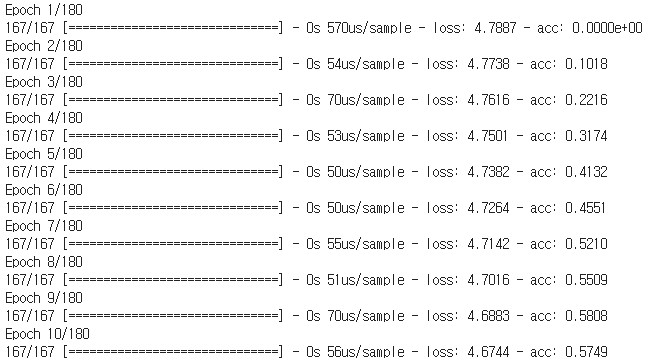

Word Embedding using Keras CBOW Word2Vec
===========================================

Keras implementation of Continuous Bag-of-Words Word2Vec.  
https://research.google/pubs/pub41224/  
Using About Wikipedia page.  
https://en.wikipedia.org/wiki/Wikipedia:About
	
    Efficient Estimation of Word Representations in Vector Space
    Tomas Mikolov, Kai Chen, Greg S. Corrado, Jeffrey Dean
    International Conference on Learning Representations, 2013

Training Usage
-----

    python TrainingModel.py train_data_file output_model_file output_char_to_index_file

    ex)
    python TrainingModel.py ./data/train_data.txt ./model/rnnlm_model.h5 ./model/char_to_index.pickle

Training Result
-----

Generation Usage
-----

    python PredictSentence.py input_model_file input_char_to_index_file "input_sentence" output_char_count

    ex)
    python PredictSentence.py ./model/rnnlm_model.h5 ./model/char_to_index.pickle "wikipedia is" 30

Generation Result
-----

